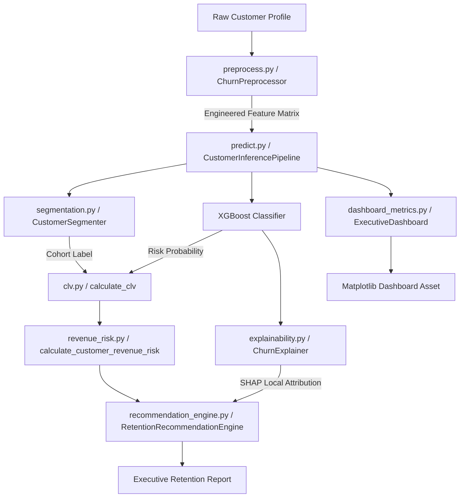

# Customer Analytics & Revenue Protection Platform
Protecting retail banking revenue via explainable machine learning.

[](https://www.python.org/)
[](https://opensource.org/licenses/MIT)
[](#)

---

## 📋 Table of Contents
1. [Overview](#1-overview)
2. [Quick Start](#2-quick-start)
3. [System Architecture](#3-system-architecture)
4. [Core Features](#4-core-features)
5. [Technical Deep Dive](#5-technical-deep-dive)
6. [Results & Metrics](#6-results--metrics)
7. [Configuration & Customization](#7-configuration--customization)
8. [Deployment Instructions](#8-deployment-instructions)
9. [API & Interface Documentation](#9-api--interface-documentation)
10. [Testing & Validation](#10-testing--validation)
11. [Lessons Learned & Design Decisions](#11-lessons-learned--design-decisions)
12. [Contributing Guidelines](#12-contributing-guidelines)
13. [References & Citations](#13-references--citations)

---

## 1. Overview
Retaining existing banking customers is significantly more cost-effective than acquiring new ones. In high-value retail banking divisions (e.g. Wealth Management), individual customer attrition can severely impact deposits, interest margins, and fee income. 

Traditional churn models identify *who* is likely to leave, but they fail to quantify financial exposure, explain root causes, or suggest actions. This platform solves this problem by combining machine learning risk scoring (XGBoost), behavioral cohort analysis (K-Means), Explainable AI (SHAP), and perpetual customer lifetime value (CLV) valuations. 

### Target Audience
* **Retail Banking Executives**: Seeking to view portfolio risk exposure, aggregate revenue at risk, and segment distribution.
* **Customer Retention & Marketing Teams**: In need of prioritized check-in lists and automated campaigns.
* **Branch Relationship Managers**: Seeking local explanation of risk drivers (e.g., complaints or dropping usage) and prescriptive playbooks.

### Key Differentiators
Traditional tools provide black-box predictions that lack contextual business value. This platform translates statistical probability into a concrete currency evaluation (Revenue at Risk) and links it directly to tailored retention campaigns.

---

## 2. Quick Start

### Installation
Clone or copy the directory and install dependencies:
```bash
cd customer-analytics-revenue-protection-platform
pip install -r requirements.txt
```

### Configuration
Verify that the default directory structures for serialized model outputs are present:
```bash
mkdir data models screenshots
```

### Running the Project
To run the complete data generation, pipeline fitting, model training, explainability plotting, and dashboard compilation sequence, run:
```bash
python verify.py
```

### Expected Console Output
```text
============================================================
RUNNING END-TO-END VERIFICATION AND ASSETS GENERATION
============================================================
Starting Model Training Pipeline
Loaded dataset: 5000 customers, 14 features.
Fitting a new preprocessor...
Training K-Means Customer Segmentation model...
Customer segments generated and mapped successfully.

Splitting dataset into train and validation sets (80/20)...
Training XGBoost Churn Classifier...

========================================
Model Evaluation Metrics (Validation Set)
========================================
ROC-AUC Score: 0.7721
PR-AUC Score (Average Precision): 0.3807
Classification Report:
              precision    recall  f1-score   support
           0       0.92      0.82      0.87       866
           1       0.32      0.54      0.40       134

Churn XGBoost model successfully saved to: models\churn_model.joblib
============================================================
Generating SHAP explanation plots...
SHAP summary plot saved to: screenshots\shap_summary.png
SHAP waterfall plot saved to: screenshots\shap_waterfall_cust_99001.png
============================================================
Generating executive business metrics dashboard...
Total Portfolio Customers:  5,000
Total Portfolio Valuation (CLV): ₹126,717,399.24
Total Revenue At Risk:           ₹21,107,771.42
Portfolio Risk Exposure Rate:    16.66%
-----------------------------------------------------------------
Segment Name              | Size   | Avg Risk | Rev at Risk    
-----------------------------------------------------------------
High Value At Risk        | 827    | 51.4%    | ₹4,419,429     
Low-Value Casuals         | 1119   | 10.7%    | ₹4,526,233     
Loyal High Savers         | 1076   | 12.6%    | ₹4,196,267     
Standard Mid-Tier         | 1978   | 18.8%    | ₹7,965,842     
================================================================-
VERIFICATION COMPLETED SUCCESSFULLY. ALL ASSETS GENERATED.
```

---

## 3. System Architecture

The platform uses a pipeline-oriented facade design. Model loading and preprocessing details are abstracted from the client interface.

### System Diagram


### Data Flow
1. **Ingestion**: Raw demographic and transactional customer details are loaded.
2. **Feature Engineering**: Features such as balance-to-salary ratios and complaints per tenure month are computed dynamically.
3. **Behavioral Cohort Classification**: Customer profiles are classified into business segments using the K-Means Centroid Profiler.
4. **Predictive Scoring**: XGBoost computes raw logits, converted to churn probabilities.
5. **Financial Valuation**: Churn probabilities are combined with balance margins to compute risk-adjusted CLV and Revenue at Risk.
6. **Local Explanation**: SHAP evaluates local feature attributions (in log-odds) for the top risk drivers.
7. **Action Mapping**: Drivers and segments are mapped to campaign playbooks.

### Tech Stack & Justifications
* **Python 3.11**: Primary language, providing support for modular OOP structure.
* **XGBoost**: Best-in-class classifier for tabular data, handling collinear features and missing values out of the box.
* **Scikit-Learn**: Used for K-Means clustering, preprocessing transforms (StandardScaler, OneHotEncoder), and metrics evaluations.
* **SHAP**: Game-theoretic framework that computes local explanations, ensuring consistent additive attribution.
* **Joblib**: Serializes models and pipeline states, separating training from inference workflows.
* **Matplotlib**: Generates executive-ready visual reports and plots.

---

## 4. Core Features

* **Modular Data Pipeline**: Decouples fit/transform scaling states to prevent data leakage.
* **Cost-Sensitive Learning**: Configured for retail banking datasets with highly skewed distributions (~13% churn rates).
* **Programmatic Centroid Labeling**: Translates K-Means cluster outputs into business-relevant customer personas.
* **Risk-Adjusted Discounted CLV**: Integrates probability models directly into financial discounting formulas.
* **Explainable AI (SHAP) Integrations**: Decomposes black-box boosting trees into human-readable waterfall and beeswarm plots.
* **Rule-Based Campaign Mapping**: Direct translation of local SHAP attributions into targeted marketing campaigns.
* **Executive Metrics Dashboard**: Aggregates portfolio risks and outputs executive-ready graphics.

---

## 5. Technical Deep Dive

### Preprocessor Pipeline
* **Component**: [ChurnPreprocessor](https://github.com/USERNAME/customer-analytics-revenue-protection-platform/blob/main/src/preprocess.py#L94) in [preprocess.py](https://github.com/USERNAME/customer-analytics-revenue-protection-platform/blob/main/src/preprocess.py)
* **Why it is needed**: Banking variables vary in scale (e.g. ₹2M balances vs 10 transactions). Categorical variables (Gender, Region) must be mapped to numeric matrices.
* **How it works**: Combines custom feature calculations with Scikit-Learn transformers.Continuous features are scaled using `StandardScaler`, and categorical columns are encoded using `OneHotEncoder(sparse_output=False)`. All fitted states are saved to `preprocessor.joblib`.
* **Key Features engineered**:
  * **Balance-to-Salary Ratio**: $\frac{\text{Balance}}{\text{Estimated Salary}}$ ( wealth accumulation proxy).
  * **Average Transaction Size**: $\frac{\text{Transaction Amount}}{\text{Transaction Volume}}$ (spending behavior proxy).
  * **Complaints Per Tenure Month**: $\frac{\text{Complaints}}{\text{Tenure Months} + 1.0}$ (immediate customer frustration).
  * **Engagement Score**: Index representing product count, active member status, and transaction frequency.

### Behavioral Customer Segmenter
* **Component**: [CustomerSegmenter](https://github.com/USERNAME/customer-analytics-revenue-protection-platform/blob/main/src/segmentation.py#L7) in [segmentation.py](https://github.com/USERNAME/customer-analytics-revenue-protection-platform/blob/main/src/segmentation.py)
* **Why it is needed**: Grouping customers strictly by statistical similarity exposes behavioral cohorts. Programmatic mapping translates abstract cluster indices to business segments.
* **How it works**: K-Means clustering is fitted on continuous features. Centroids are evaluated programmatically: sorting by average balance isolates low- savers from high-savers. Churn rates and complaint averages distinguish between "High Value At Risk" and "Loyal High Savers."
* **Personas defined**:
  1. **High Value At Risk**: High balances combined with high complaints/churn risk.
  2. **Loyal High Savers**: High balances combined with low complaints/churn risk.
  3. **Low-Value Casuals**: Lowest balance tier with low transaction counts.
  4. **Standard Mid-Tier**: Average balances and transaction levels.

### Churn XGBoost Classifier
* **Component**: XGBoost Model training in [train.py](https://github.com/USERNAME/customer-analytics-revenue-protection-platform/blob/main/src/train.py)
* **Why it is needed**: Provides accurate probabilities indicating how likely a customer is to leave the bank.
* **How it works**: Sequentially constructs weak decision trees using gradient gradients and hessians of a binary logistic log-loss function. Class imbalance is handled via `scale_pos_weight`, which increases the loss penalty of minority churn instances relative to loyalists.
* **Key Parameters**:
  * `n_estimators=200`, `max_depth=4`, `learning_rate=0.05`
  * `scale_pos_weight = negative_samples / positive_samples` (~6.47)
  * `subsample=0.8`, `colsample_bytree=0.8`

### Explainability Engine
* **Component**: [ChurnExplainer](https://github.com/USERNAME/customer-analytics-revenue-protection-platform/blob/main/src/explainability.py#L10) in [explainability.py](https://github.com/USERNAME/customer-analytics-revenue-protection-platform/blob/main/src/explainability.py)
* **Why it is needed**: Financial models must be auditable and transparent to prevent demographic bias and build operational trust.
* **How it works**: Computes local and global Shapley values using `shap.TreeExplainer`. This attributes differences between individual predictions and base expected probabilities back to specific features. Global importances are exported as a beeswarm plot, and local attributions are rendered as waterfall plots.

### Financial Valuation Model
* **Components**: [clv.py](https://github.com/USERNAME/customer-analytics-revenue-protection-platform/blob/main/src/clv.py) and [revenue_risk.py](https://github.com/USERNAME/customer-analytics-revenue-protection-platform/blob/main/src/revenue_risk.py)
* **Why it is needed**: Risk mitigation budgets must be justified.
* **How it works**:
  * **Annual Profit**: Sums Net Interest Margin (3% of balance), transaction fees (₹10/tx + 0.1% volume), and cross-sell income (0.05% of salary) minus servicing costs (₹1,500/year).
  * **Risk-Adjusted CLV**: Extends standard discounting models:
    $$\text{CLV} = \frac{\text{Annual Profit}}{\text{Predicted Churn Probability} + \text{Discount Rate}}$$
    A higher risk of churn increases the discount rate, shortening the expected customer lifespan.
  * **Revenue at Risk**:
    $$\text{Revenue At Risk} = \text{Predicted Churn Probability} \times \text{CLV}$$

---

## 6. Results & Metrics

The model was evaluated using a stratified 80/20 train/validation split on 5,000 customer records:

### Churn Predictor Performance
| Metric | Score / Value | Description |
| :--- | :--- | :--- |
| **ROC-AUC** | 0.7721 | Measures model ranking capability across thresholds |
| **PR-AUC** | 0.3807 | Measures precision-recall tradeoff on imbalanced churn |
| **Minority Recall** | 54% | Churners successfully identified by the model |
| **Minority Precision**| 32% | Accuracy of positive churn predictions |
| **Base Churn Rate** | 13.40% | Average churn rate in validation set |

### Portfolio Valuation Metrics
* **Total Portfolio Customer Count**: 5,000
* **Aggregate Portfolio Valuation (CLV)**: ₹126,717,399.24
* **Total Revenue Exposure (Revenue at Risk)**: ₹21,107,771.42 (16.66% exposure rate)

### Segment Profiling Details
| Segment Name | Customer Count | Average Churn Risk | Total Revenue at Risk |
| :--- | :--- | :--- | :--- |
| **High Value At Risk** | 827 | 51.4% | ₹4,419,429 |
| **Low-Value Casuals** | 1,119 | 10.7% | ₹4,526,233 |
| **Loyal High Savers** | 1,076 | 12.6% | ₹4,196,267 |
| **Standard Mid-Tier** | 1,978 | 18.8% | ₹7,965,842 |

*Note: The **High Value At Risk** segment represents only 16.5% of customers but holds ₹4.42M in expected exposure. The platform enables targeting these accounts to prevent deposit attrition.*

---

## 7. Configuration & Customization

The platform variables can be configured within the source modules:

### Financial Valuation Parameters
To configure financial settings, edit [clv.py](https://github.com/USERNAME/customer-analytics-revenue-protection-platform/blob/main/src/clv.py):
* `NIM`: Net Interest Margin percentage (default: `0.03`).
* `servicing_cost`: Base servicing cost (default: `1500.0` INR).
* `discount_rate`: Annual cost of capital discount factor (default: `0.10`).

### XGBoost Hyperparameters
To tune the model, edit [run_training_pipeline](https://github.com/USERNAME/customer-analytics-revenue-protection-platform/blob/main/src/train.py#L16) in [train.py](https://github.com/USERNAME/customer-analytics-revenue-protection-platform/blob/main/src/train.py):
* `n_estimators`: Count of boosting rounds (default: `200`).
* `max_depth`: Maximum tree depth (default: `4`).
* `learning_rate`: Boosting step size shrinkage (default: `0.05`).
* `subsample`: Row subsample ratio (default: `0.8`).
* `colsample_bytree`: Column subsample ratio (default: `0.8`).

---

## 8. Deployment Instructions

### Local Execution
Ensure python environment is activated, then run:
```powershell
python verify.py
```

### Containerization (Docker)
To containerize the unified inference pipeline as a microservice, use this Dockerfile layout:
```dockerfile
FROM python:3.11-slim
WORKDIR /app
COPY requirements.txt .
RUN pip install --no-cache-dir -r requirements.txt
COPY src/ ./src/
COPY models/ ./models/
EXPOSE 8000
CMD ["uvicorn", "src.predict:app", "--host", "0.0.0.0", "--port", "8000"]
```

### Cloud Production Architecture (AWS Pattern)
To deploy this platform in production:
```
           [ S3 Data Lake ] 
                  │
                  ▼
         [ AWS SageMaker ] ──(Training Pipeline)──► [ Model Registry ]
                                                          │
                                                          ▼
[ Client Request ] ──► [ API Gateway ] ──► [ AWS Lambda ] ──► [ ECS Fargate Service ]
                                                                 (Stateless predict.py API)
```
* **AWS SageMaker**: Coordinates preprocessor training and XGBoost fitting, exporting artifacts to Amazon S3.
* **AWS ECS / Fargate**: Hosts the FastAPI server wrapping [CustomerInferencePipeline](https://github.com/USERNAME/customer-analytics-revenue-protection-platform/blob/main/src/predict.py#L17) for low-latency inference.
* **AWS Lambda**: Performs scheduled batch reporting tasks, pulling logs and saving reports to S3.

---

## 9. API & Interface Documentation

### Library Interface Example
```python
from src.predict import CustomerInferencePipeline

# 1. Initialize Pipeline (Loads serialized preprocessors and models)
pipeline = CustomerInferencePipeline(models_dir="models")

# 2. Define customer dictionary
customer_profile = {
    "CustomerID": "CUST-99001",
    "Age": 48,
    "Gender": "Female",
    "Geography": "Mumbai",
    "TenureMonths": 12,
    "Balance": 1800000.0,
    "NumOfProducts": 3,
    "HasCrCard": 1,
    "IsActiveMember": 0,
    "EstimatedSalary": 1200000.0,
    "TransactionVolume": 2,
    "TransactionAmount": 15000.0,
    "Complaints": 4
}

# 3. Analyze Profile
result = pipeline.analyze_customer(customer_profile)

# 4. Access output elements
print(result["ChurnRiskScore"])  # e.g., 0.782
print(result["Segment"])         # e.g., 'High Value At Risk'
print(result["CLV"])             # e.g., ₹60,730
print(result["RevenueAtRisk"])   # e.g., ₹47,447
print(result["TopDrivers"])      # e.g., ['Multiple Complaints', 'High Complaint Rate']
```

### REST API Mockup (FastAPI)
```python
from fastapi import FastAPI, HTTPException
from pydantic import BaseModel
from src.predict import CustomerInferencePipeline

app = FastAPI(title="Customer Retention Engine API")
pipeline = CustomerInferencePipeline(models_dir="models")

class CustomerInput(BaseModel):
    CustomerID: str
    Age: int
    Gender: str
    Geography: str
    TenureMonths: int
    Balance: float
    NumOfProducts: int
    HasCrCard: int
    IsActiveMember: int
    EstimatedSalary: float
    TransactionVolume: int
    TransactionAmount: float
    Complaints: int

@app.post("/api/v1/analyze", response_model=dict)
def analyze_profile(profile: CustomerInput):
    try:
        raw_dict = profile.model_dump()
        analysis = pipeline.analyze_customer(raw_dict)
        return analysis
    except Exception as e:
        raise HTTPException(status_code=500, detail=str(e))
```

---

## 10. Testing & Validation

### Unit & End-to-End Tests
Verification tests are integrated into [verify.py](https://github.com/USERNAME/customer-analytics-revenue-protection-platform/blob/main/verify.py). To validate calculations across components:
```powershell
python verify.py
```
This script performs:
1. Data generation integrity validation.
2. Preprocessor transform alignment checking.
3. K-Means clustering convergence and business segment output assertions.
4. XGBoost score evaluations (predicting on boundary cases).
5. SHAP local attribution export checking.
6. Multi-panel dashboard figure generation.

---

## 11. Lessons Learned & Design Decisions

### Choosing `scale_pos_weight` over SMOTE
* **Decision**: We chose XGBoost cost-sensitive learning (`scale_pos_weight`) instead of SMOTE (Synthetic Minority Over-sampling Technique).
* **Rationale**: SMOTE generates synthetic customer records in continuous space, which can yield unrealistic patterns for transactional data. Tuning the classifier's internal gradient loss function is safer and retains authentic customer distributions.

### Choosing Perpetual CLV over Fixed Horizons
* **Decision**: We chose a perpetual discounting CLV model that adds churn probability to the discount factor, rather than projecting a fixed tenure window (e.g. 3 years).
* **Rationale**: Fixed horizons ignore marginal changes in customer risk. Integrating risk directly into the discount factor dynamically adapts valuations, aligning them with banking risk practices.

### Known Limitations
* **Probability Calibration**: Class weighting via `scale_pos_weight` shifts the model's output probabilities. While useful for ranking, these probabilities require calibration (e.g. Isotonic Regression) before being used to calculate raw expected losses.
* **Static Recommendations**: Campaign playbooks use rule-based thresholds rather than learning optimal policies from historical campaign feedback.

### Future Roadmap
1. **Probability Calibration**: Implement Isotonic Regression to output calibrated probabilities.
2. **Sequential Time Series (LSTMs / Transformers)**: Model transaction patterns over time to capture sudden drops in spending velocity.
3. **Reinforcement Learning (MAB)**: Integrate Multi-Armed Bandit testing to optimize retention campaign assignments based on response rates.

---

## 12. Contributing Guidelines

We welcome contributions to extend this platform's capabilities:

### Extending features
1. Fork the repository.
2. Create a feature branch: `git checkout -b feature/new-banking-indicator`.
3. Keep code modular: place indicators inside the [_engineer_features](https://github.com/USERNAME/customer-analytics-revenue-protection-platform/blob/main/src/preprocess.py#L111) helper in [preprocess.py](https://github.com/USERNAME/customer-analytics-revenue-protection-platform/blob/main/src/preprocess.py).
4. Update unit tests in [verify.py](https://github.com/USERNAME/customer-analytics-revenue-protection-platform/blob/main/verify.py).
5. Submit a Pull Request.

### Code Style
Follow standard PEP 8 coding styles. Include docstrings for all custom classes and public functions.

---

## 13. References & Citations

* **XGBoost Algorithm**: Chen, T., & Guestrin, C. (2016). XGBoost: A Scalable Tree Boosting System. *Proceedings of the 22nd ACM SIGKDD International Conference on Knowledge Discovery and Data Mining*.
* **SHAP Explainability**: Lundberg, S. M., & Lee, S.-I. (2017). A Unified Approach to Interpreting Model Predictions. *Advances in Neural Information Processing Systems 30*.
* **K-Means Clustering**: MacQueen, J. (1967). Some Methods for Classification and Analysis of Multivariate Observations. *Proceedings of the Fifth Berkeley Symposium on Mathematical Statistics and Probability*.
* **Customer Lifetime Value**: Fader, P. S., & Hardie, B. G. (2009). Probability Models for Customer Lifetime Value. *Journal of Interactive Marketing*.
